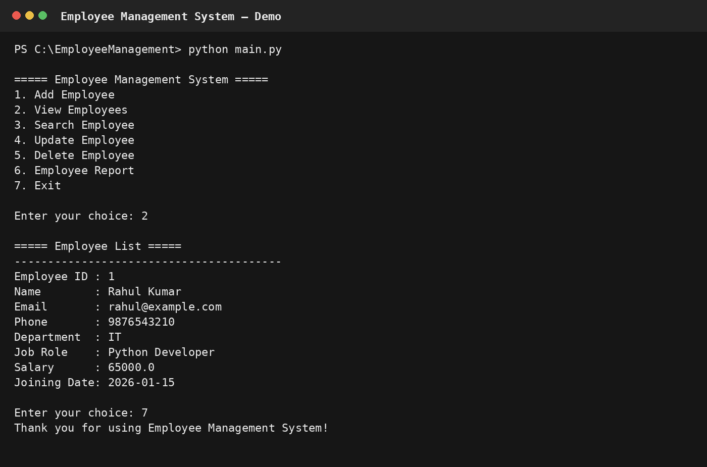
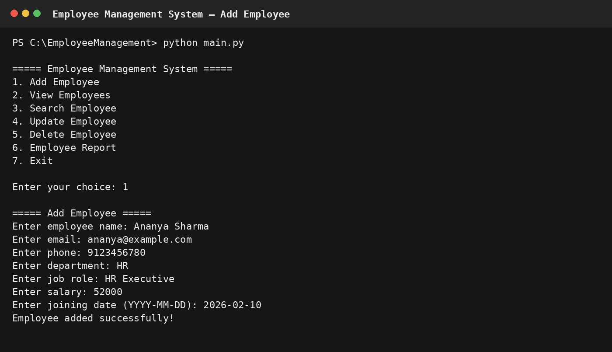
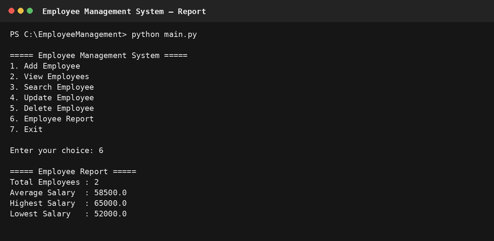

# Employee Management System

A console-based **Employee Management System** built with **Python, SQLite, and SQL**.  
The project demonstrates practical CRUD operations, database connectivity, input validation, exception handling, and employee salary analytics.

## 📌 Project Overview

This application provides a simple way to manage employee records from a command-line interface.

### Core Operations

- ➕ Add employee
- 📋 View all employees
- 🔎 Search by employee ID or name
- ✏️ Update employee details
- 🗑️ Delete employee records
- 📊 Generate salary and employee reports
- 🛡️ Handle invalid input and database errors

## 🛠️ Tech Stack

| Technology | Purpose |
|---|---|
| Python | Application logic and CLI |
| SQLite | Lightweight relational database |
| SQL | Data definition, CRUD, filtering, sorting, and aggregation |
| Git & GitHub | Version control and project hosting |

## 🗂️ Project Structure

```text
EmployeeManagement/
│
├── database.py              # SQLite connection
├── employee.py              # Employee operations and SQL queries
├── main.py                  # CLI menu and application entry point
├── README.md                # Project documentation
├── .gitignore               # Ignores local database/cache files
└── screenshots/
    ├── menu.png
    ├── add_employee.png
    └── employee_report.png
```

## 🚀 How to Run

### 1. Clone the repository

```bash
git clone https://github.com/s-mamatha/EmployeeManagement.git
cd EmployeeManagement
```

### 2. Run the application

```bash
python main.py
```

The SQLite database file is created automatically when the application starts.

## 🖥️ Screenshots

### Main Menu & Employee Records



### Add Employee



### Employee Report



## 🗄️ Database Design

The application uses a single `employees` table with fields for:

- Employee ID
- Name
- Email
- Phone
- Department
- Job Role
- Salary
- Joining Date

The employee ID is the primary key, while email addresses are kept unique.

## 💡 SQL Concepts Demonstrated

The project uses practical SQL concepts including:

- `CREATE TABLE`
- `INSERT`
- `SELECT`
- `UPDATE`
- `DELETE`
- `WHERE`
- `LIKE`
- `ORDER BY`
- `COUNT()`
- `AVG()`
- `MAX()`
- `MIN()`
- Parameterized queries using `?`

## 🔐 Error Handling

The application includes:

- Salary and employee-ID input validation
- Duplicate email handling
- Database exception handling
- Transaction rollback when an insert/update fails
- Confirmation before deleting an employee

## 🎯 What This Project Demonstrates

This project is designed as a practical beginner-to-intermediate Python + SQL project and demonstrates how a Python application can interact with a relational database to perform real CRUD and reporting tasks.

## 👤 Author

**Pandu**

Built for learning, portfolio development, and interview preparation.
